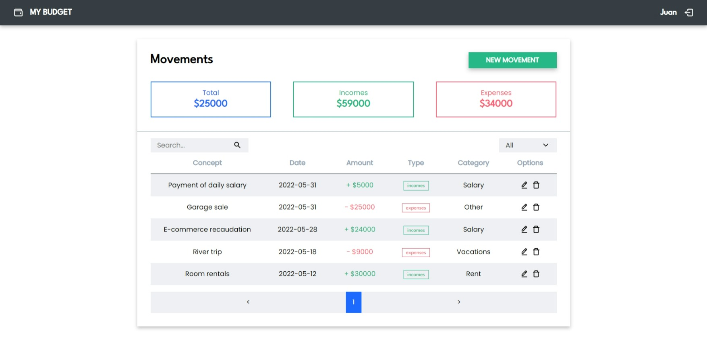

# Personal Budget Management

Personal budget management application to create, edit, and delete cash incomes and expenses, showing a resulting balance of the transactions.

Originally, this is a challenge:
* Requirements: <a href="./challenge.pdf" target="_blank">Open PDF</a>

*MERN, Redux TK, API, CRUD, JWT Authentication, Search function.*



### Table of contents 📃

- [Personal Budget Management](#personal-budget-management)
    - [Table of contents 📃](#table-of-contents-)
  - [Starting 🚀](#starting-)
    - [Pre-requirements 📋](#pre-requirements-)
    - [Installation 🔧](#installation-)
  - [Deployment 📦](#deployment-)
  - [Built with 🛠️](#built-with-️)

## Starting 🚀
  
### Pre-requirements 📋

* [Git](https://git-scm.com/)
* [npm](https://www.npmjs.com/)
* [MySQL DB](https://www.mysql.com/)

### Installation 🔧

Local installation:

```bash
# Clone this repository
$ git clone https://github.com/Ju4npx/personal-budget-management.git

# Change directory to the project path
$ cd personal-budget-management
```

---

**Backend setup:**
```bash
# Change directory to the backend path
$ cd backend

# Install dependencies
$ npm install

# Copy .env file
$ cp .env.example .env
```

backend **.env** file setup example:

```shell
PORT=5000
FRONTEND_URL=http://localhost:3000

DB_DIALECT=mysql
DB_HOST=127.0.0.1
DB_PORT=3306
DB_DATABASE=personal_budget_management
DB_USERNAME=root
DB_PASSWORD=

JWT_SECRET_KEY=my_random_key
```

---

**Frontend setup:**
```bash
# Go back to the project path
$ cd ..

# Change directory to the frontend path
$ cd frontend

# Install dependencies
$ npm install

# Copy .env file
$ cp .env.example .env
```

frontend **.env** file setup example:

```shell
VITE_BACKEND_URL="http://localhost:5000/api"
```

## Deployment 📦

```bash
# Open terminal in project path and run
$ cd frontend
$ npm run dev

# Open another terminal in project path and run
$ cd backend
$ npm start
```

Open [http://localhost:3000](http://localhost:3000) to view it in your browser.

## Built with 🛠️

* [React](https://reactjs.org/) - Frontend
* [React Redux Tk](https://redux-toolkit.js.org/) - State management
* [Node.js](https://nodejs.org/) - Javascript runtime environment
* [Express.js](https://expressjs.com/) - Backend
* [MySQL](https://www.mysql.com/) - Database

---
⌨️ with ❤️ by [Juan Pablo Machado](https://github.com/Ju4npx ) 😊 